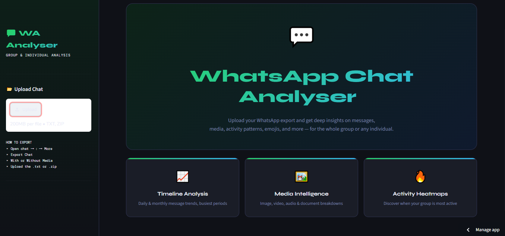
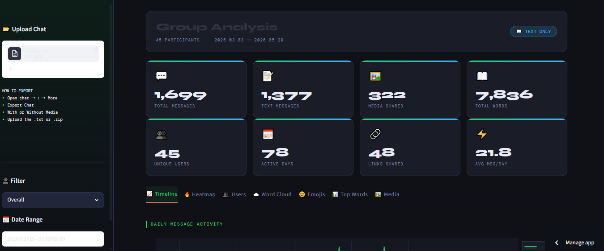
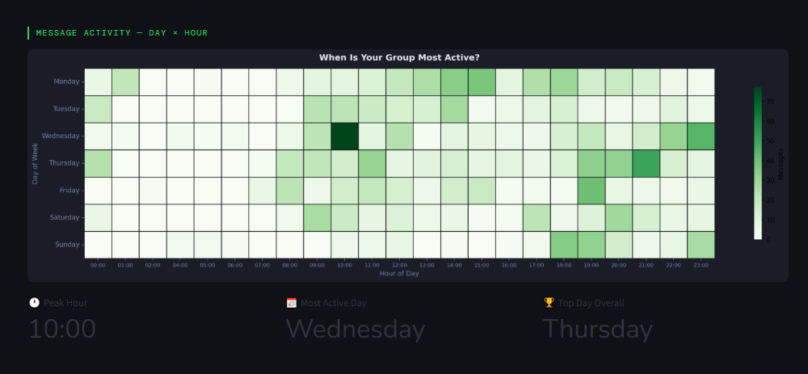
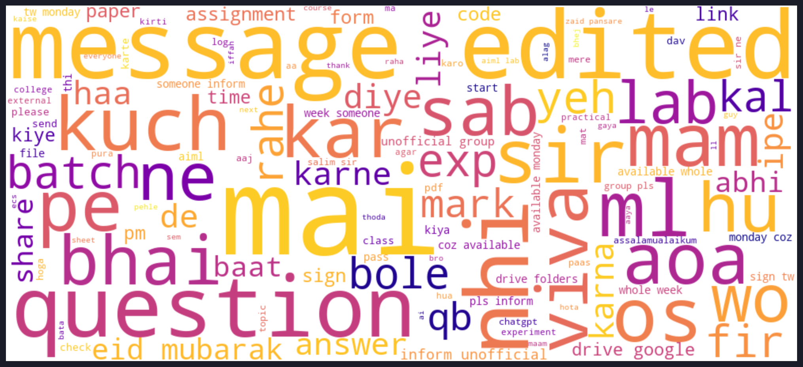
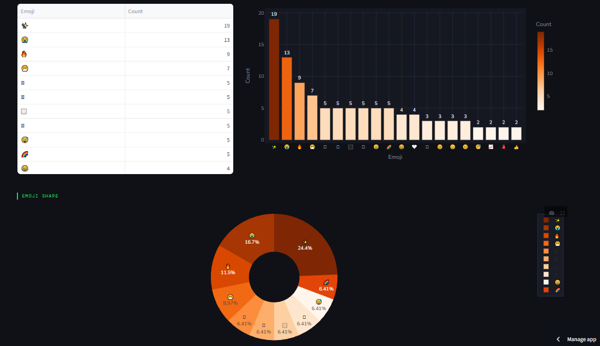
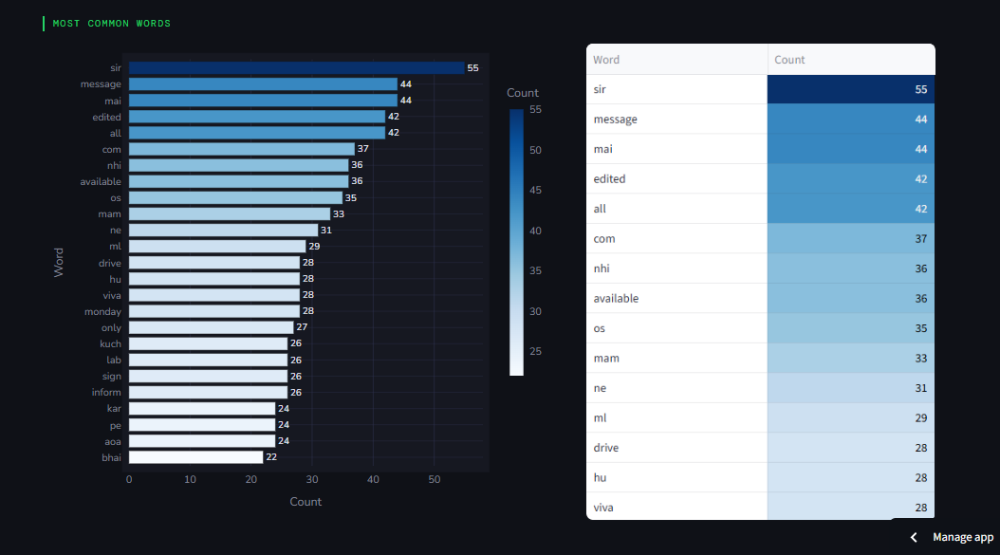
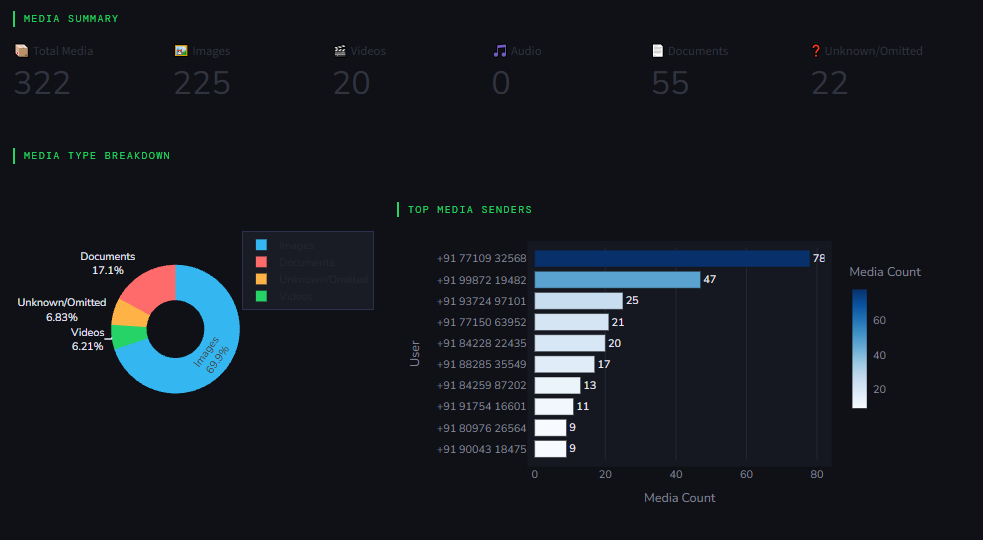
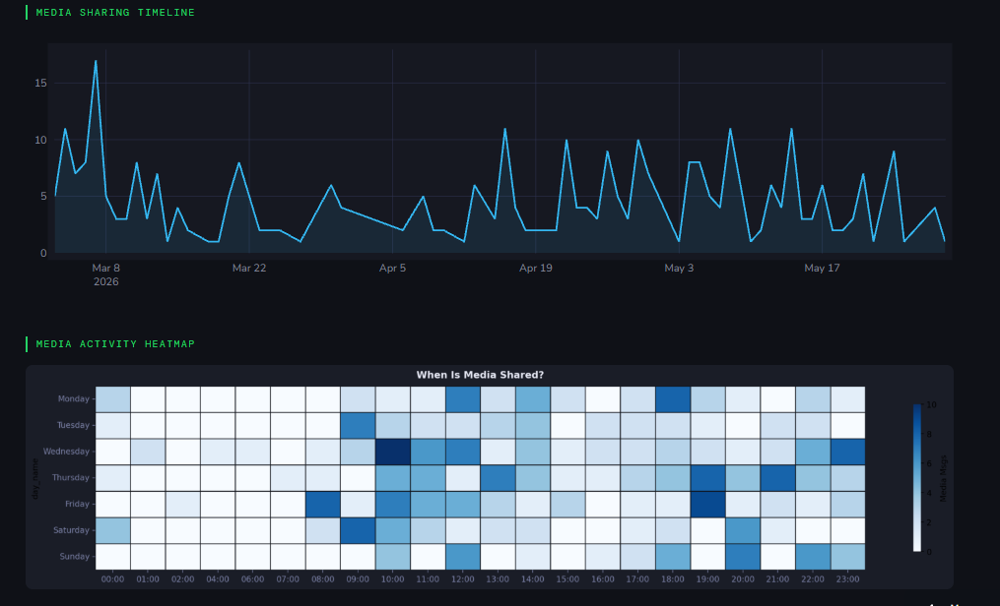

# 💬 WhatsApp Chat Analyzer

<div align="center">


**A comprehensive WhatsApp chat analytics dashboard that transforms exported `.txt` chat files into rich visual insights — message statistics, sentiment trends, topic modeling, activity heatmaps, and more.**

[🚀 Live Demo](#live-demo) • [📂 Repository Structure](#repository-structure) • [⚙️ Installation](#installation--usage) • [📊 Results--sample-insights)

</div>

---

## 📌 Project Overview

WhatsApp conversations contain a wealth of behavioral and linguistic data that most people never explore. This project builds a **zero-setup analytics tool** — users simply export their WhatsApp chat (any group or individual conversation) and upload the `.txt` file to get an instant, fully visual analysis.

The tool covers the entire analytics pipeline: raw text parsing → feature extraction → NLP analysis (sentiment, keywords, topics) → interactive visualizations — all without requiring any API keys, cloud services, or technical setup from the user.

Designed to work with **both English and Hinglish** (Hindi-English code-switching) chat exports, making it practical for Indian users.

---

## ✅ Features

### 📊 Message Analytics
- Total message count, word count, and media shared per participant
- Message frequency over time (daily, weekly, monthly trends)
- Most active day of week and hour of day
- Average response time per participant
- Conversation initiator analysis

### 🗺️ Activity Heatmaps
- Hour × Day of week heatmap showing peak activity windows
- Monthly activity calendar view
- Participant-level activity comparison

### 😂 Emoji Analysis
- Top emojis per participant
- Emoji frequency timeline
- Emoji sentiment mapping

### 📤 Export
- Download full analysis summary as PDF report
- Export parsed message dataframe as CSV

---

## 📂 Dataset

This project uses **user-provided WhatsApp export files** — no external dataset is required.

### How to Export Your WhatsApp Chat

**Android:**
1. Open the chat → Tap ⋮ (three dots) → More → Export chat
2. Choose "Without Media"
3. Share the `.txt` file to your device / email

**iPhone:**
1. Open the chat → Tap the contact/group name → Export Chat
2. Choose "Without Attachments"
3. Save the `.txt` file

### Supported Export Formats

| Format | Example |
|--------|---------|
| Android (12-hr) | `12/25/23, 10:30 AM - John: Hello!` |
| Android (24-hr) | `25/12/2023, 22:30 - John: Hello!` |
| iOS | `[25/12/23, 10:30:00 PM] John: Hello!` |
| Hinglish | Fully supported — mixed Hindi-English parsing |

### Sample Data

A **synthetic anonymized sample chat** (`data/sample_chat.txt`) is included for demo purposes — no real user data is bundled.

---

## 🧠 Methodology

### Parsing Pipeline

```
WhatsApp .txt Export
         │
         ▼
  ┌──────────────────────┐
  │  Regex-based Parser  │  Handles Android/iOS format variants
  │  - Timestamp extract │  
  │  - Sender extract    │  
  │  - Message extract   │  
  │  - Media flag        │  
  └──────────────────────┘
         │
         ▼
  Structured DataFrame
  [timestamp | sender | message | is_media | word_count]
         │
    ┌────┴──────────────────┐
    ▼                       ▼
Feature Engineering     NLP Analysis
(temporal features,    (sentiment, keywords,
 response times,        emojis)
 activity stats)
         │                  │
         └────────┬─────────┘
                  ▼
         Streamlit Dashboard
         (Plotly Charts + WordCloud)
```

### Regex Parser

The parser handles the wide variety of WhatsApp timestamp formats using a multi-pattern matcher:

```python
import re

PATTERNS = [
    # Android 12-hour
    r'(\d{1,2}/\d{1,2}/\d{2,4},\s\d{1,2}:\d{2}\s[AP]M)\s-\s([^:]+):\s(.*)',
    # Android 24-hour
    r'(\d{1,2}/\d{1,2}/\d{2,4},\s\d{2}:\d{2})\s-\s([^:]+):\s(.*)',
    # iOS
    r'\[(\d{1,2}/\d{1,2}/\d{2,4},\s\d{1,2}:\d{2}:\d{2}\s[AP]M)\]\s([^:]+):\s(.*)',
]
```

System messages (group joins, calls missed, etc.) are automatically filtered out.

### Activity Heatmap

```python
import plotly.express as px

# Pivot: hour (0-23) × day of week (Mon-Sun)
heatmap_data = df.groupby(['hour', 'day_name'])['message'].count().unstack()
fig = px.imshow(heatmap_data, color_continuous_scale='Blues')
```

---

## 📊 Results — Sample Insights

The following insights are from the included **synthetic demo chat** (2 participants, 6 months, ~3,200 messages):

### Message Statistics

| Metric | Participant A | Participant B |
|--------|--------------|--------------|
| Total Messages | 1,847 | 1,353 |
| Total Words | 14,203 | 9,871 |
| Media Shared | 312 | 189 |

### Top Activity Window
- **Peak Hour:** 9 PM – 10 PM
- **Most Active Day:** Sunday
- **Quietest Period:** 4 AM – 7 AM (expected)

### Screenshots










```


## ⚙️ Installation & Usage

### Prerequisites

```
Python 3.9+
pip
```

### 1. Clone the Repository

```bash
git clone https://github.com/YOUR_USERNAME/whatsapp-chat-analyzer.git
cd whatsapp-chat-analyzer
```

### 2. Install Dependencies

```bash
pip install -r requirements.txt
```

**`requirements.txt`**
```
streamlit>=1.28.0
pandas>=2.0.0
numpy>=1.24.0
matplotlib>=3.7.0
plotly>=5.15.0
wordcloud>=1.9.2
emoji>=2.8.0
nltk>=3.8.1
Pillow>=10.0.0
```
### 3. Run the App

```bash
streamlit run app.py
```

### 4. Using the Dashboard

1. **Export your chat** from WhatsApp (without media, `.txt` format)
2. **Upload** the `.txt` file via the file uploader on the home page
3. **Select participants** to include/exclude from analysis
4. **Set date range** (optional) to analyze a specific time period
5. **Navigate tabs** — Overview, Activity, Sentiment, Keywords, Topics, Emojis
6. **Export** the full report as PDF or download the parsed CSV

> 🔒 **Privacy:** All processing happens locally in your browser session. Your chat data is never stored, transmitted, or logged.

---

## 🚀 Live Demo

> 🔗 **[Streamlit Cloud Deployment — Click Here](https://whatsapp-chat-analysis-mkj7fps677llcpm3ktjpxy.streamlit.app/)**

The live demo includes a **pre-loaded synthetic chat** so you can explore all features without uploading your own data. You can also upload any real WhatsApp export to analyze.

---

## 📁 Repository Structure

```
whatsapp-chat-analyzer/
│
├── app.py                          # Main Streamlit application
├── requirements.txt
├── README.md
│
│
├── data/
│   └── sample_chat.txt             # Synthetic demo chat (anonymized)
│
│
│
├── images/


```

---

## 🛠️ Tech Stack

| Component | Technology |
|-----------|-----------|
| **Language** | Python 3.9+ |
| **Parsing** | Regex (re), pandas |
| **Sentiment** | VADER (vaderSentiment) |
| **Keywords** | scikit-learn (TF-IDF) |
| **Topics** | scikit-learn (LDA) |
| **Emoji** | emoji library |
| **Visualization** | Plotly, Matplotlib, WordCloud |
| **PDF Export** | FPDF2 |
| **Frontend** | Streamlit |
| **Deployment** | Streamlit Community Cloud |

---

## 🔭 Future Improvements

- [ ] **Multilingual sentiment** — dedicated Hinglish sentiment model (current VADER is English-only)
- [ ] **BERT-based topic modeling** — BERTopic for more coherent, semantically-rich topics
- [ ] **Network graph analysis** — visualize reply chains and conversation dynamics
- [ ] **Conversation summarization** — DistilBART summary of the full chat history
- [ ] **Group chat support** — per-participant analysis for groups with 3+ members
- [ ] **Telegram export support** — extend parser to handle Telegram `.json` exports

---

## 🔒 Privacy Notice

This tool processes your chat data **entirely locally**. When running locally (`streamlit run app.py`), no data leaves your machine. The deployed Streamlit Cloud version processes data in-session only — nothing is persisted after you close the tab.

Do not upload chats containing sensitive personal, financial, or medical information to any third-party hosted version.

---

## 👤 Author

**Arham**


<div align="center">
⭐ Star this repo if you found it useful!
</div>
